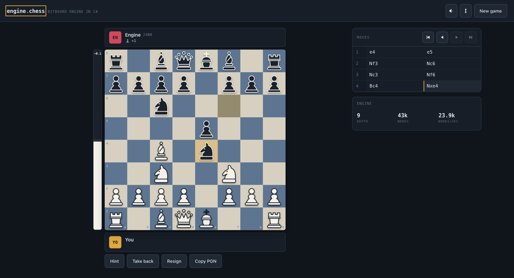

# Engine.Chess

A chess engine written from scratch in C#, and a browser interface to play it. No
chess libraries: the move generator, evaluation, search, opening book and game
analysis are all in this repository.

Play a full game against one of six bots, then have the engine review every move
you made and tell you how accurately you played.

**[Play it in your browser](https://ryjord.github.io/ChessEngine/)** — no install required.



## Running it

Requires the [.NET 10 SDK](https://dotnet.microsoft.com/download).

```bash
dotnet run --project Engine.UI
```

Then open <http://localhost:5208>.

```bash
dotnet test          # 120 tests, about a second
dotnet build -c Release
```

## What is in here

| Project | Contents |
| --- | --- |
| `Engine.Chess` | The engine. No dependencies, no I/O, no framework references. |
| `Engine.Chess.Tests` | 120 xUnit tests, including the standard perft suite. |
| `Engine.UI` | Blazor WebAssembly interface. No CSS or component libraries. |

The engine project is deliberately free of anything to do with the interface, so
the same code backs the browser app, the tests and any future front end.

## The engine

### Board representation

The board is twelve [bitboards](https://www.chessprogramming.org/Bitboards), one
per coloured piece, kept in step with a 64-entry array that answers "what is on
this square" without a search. Squares are indexed a1 = 0 to h8 = 63.

Moves are applied in place and reverted from an undo stack rather than by copying
the position. A search visits hundreds of thousands of nodes per move, and copying
a board at every one of them is the difference between a usable engine and an
unusable one.

Positions are hashed with [Zobrist keys](https://www.chessprogramming.org/Zobrist_Hashing)
updated incrementally as pieces move, which is what makes the transposition table
and repetition detection cheap.

### Move generation

Moves are generated fully legal in a single pass. Rather than producing
pseudo-legal moves and filtering them by making each one and testing the king, the
generator works out up front which squares can resolve a check and which pieces
are pinned, then only emits moves that respect both.

En passant is the one case that still needs an explicit test, because it is the
only move in chess that removes two pieces from a rank at once and can therefore
uncover a rook that no pin test would have seen.

Correctness is established by [perft](https://www.chessprogramming.org/Perft):
counting every leaf node at a fixed depth and comparing against totals the chess
programming community has agreed on for decades. All seven standard positions pass.

| Position | Depth | Nodes |
| --- | --- | --- |
| Starting position | 5 | 4,865,609 |
| Kiwipete | 4 | 4,085,603 |
| En passant pin | 5 | 674,624 |
| Promotions | 4 | 422,333 |
| Promotions mirrored | 4 | 422,333 |
| Cramped | 4 | 2,103,487 |
| Middlegame | 4 | 3,894,594 |

These positions exist precisely because each one breaks a different naive
implementation. Two further tests check that unmaking every move restores the
position exactly, and that the incrementally updated hash always matches one
computed from scratch.

### Evaluation

Every term is scored twice, once for a middlegame board and once for an endgame
board, and the two are blended by how much material is left. Without that taper an
engine plays the opening like an endgame, marching its king up the board while the
queens are still on.

The terms are material, piece-square tables, mobility, bishop pair, doubled,
isolated and passed pawns, rook placement on open and half-open files, a pawn
shield in front of the king, and pressure on the squares around the enemy king.

### Search

Negamax alpha-beta, with:

- **Iterative deepening**, searching depth 1, then 2, and so on. Each pass orders
  the moves for the next, which makes the whole sequence faster than jumping
  straight to the final depth.
- **A transposition table** so a position reached by a different move order is not
  searched twice.
- **Quiescence search**, which continues past the depth limit until no captures
  remain. Without it the search happily stops halfway through an exchange and
  evaluates a position with a queen hanging as though nothing were wrong. This is
  the single largest source of tactical blunders in an engine that lacks it.
- **Principal variation search**, proving the moves after the first are worse with
  a null window instead of scoring them properly.
- **Null-move pruning**, disabled in pawn endgames where zugzwang makes passing a
  genuinely bad option.
- **Late move reductions** and **futility pruning**.
- **Move ordering** by transposition move, then captures ranked by
  [static exchange evaluation](https://www.chessprogramming.org/Static_Exchange_Evaluation),
  then killer moves and a history table.

Almost all of the strength comes from the ordering rather than from visiting more
nodes: alpha-beta only prunes well when the best move is tried first.

### Speed

Measured on an Apple M-series laptop, release build:

| | |
| --- | --- |
| Perft, starting position | 22M nodes/sec |
| Search, native .NET | depth 15 from the starting position in 1 second |
| Search, browser WebAssembly | around 23k nodes/sec, depth 9 per move |

The browser is far slower than native because Blazor WebAssembly runs the engine
through an IL interpreter by default. The bots' time budgets are set for that.
Publishing with `<RunAOTCompilation>true</RunAOTCompilation>` trades a much longer
build and a larger download for a substantial speed-up.

## Playing against it

Six bots, from a beginner to the engine with no handicap:

| Bot | Rating | How it plays |
| --- | --- | --- |
| Pawn | 400 | Moves almost at random and misses most threats. |
| Rookie | 800 | Takes free material but walks into tactics. |
| Club | 1200 | Solid basics. Punishes anything you leave hanging. |
| Expert | 1600 | Real openings, calculates ahead, rarely drops material. |
| Master | 2000 | Sharp tactics and strong positional judgement. |
| Engine | 2400 | No handicap. Plays the best move it finds. |

Strength is limited in two ways rather than one. A depth limit alone makes a poor
weak opponent: a shallow engine still never hangs a piece to a two-move tactic, so
it feels alien rather than weak. Each bot therefore also has a tolerance for
playing a move measurably worse than the best one it found, chosen with a weighting
that keeps near-best moves far more likely than bad ones. That reproduces the actual
signature of a weaker player, which is finding good moves most of the time and
missing them the rest.

Two rules override the handicap: no bot will decline a forced mate, in either
direction, because a bot that misses mate in one reads as broken rather than weak.

The opening book holds mainlines of about thirty openings, stored as text and
replayed through the move generator at startup so every book move is verified
rather than trusted.

## Game review

After a game, the engine replays it and judges each move on the scale players
recognise: **Brilliant**, **Great**, **Best**, **Excellent**, **Good**, **Book**,
**Inaccuracy**, **Mistake**, **Missed win** and **Blunder**.

Each position is scored once, with every legal move given a real score rather than
the bound alpha-beta would otherwise leave behind. That single pass supplies
everything the classifier needs: the best move, the played move's own score, and
the gap to the second best, which is what separates a move that was merely correct
from one that was the only thing holding the position together.

Accuracy is not measured in centipawns. Going from +0.2 to +0.9 is barely a change
in practical terms, whereas going from +0.2 to -0.5 flips who is winning, and both
are a 70-centipawn swing. Scores are converted to an expected result first, so a
move is judged by how much it changed the likely outcome, which is what a player
actually feels.

A sacrifice is detected by static exchange: a move is brilliant when the engine
still prefers it even though the opponent can win material, which is what makes a
sacrifice brilliant rather than careless.

The estimated rating from a single game is deliberately coarse and is labelled an
estimate everywhere it appears. Accuracy over one game is noisy, and short or
forced games inflate it because there are fewer chances to go wrong.

## The interface

Blazor WebAssembly, with no component or CSS library. The board is three stacked
layers rather than a grid of cells, because positioning pieces absolutely is what
allows a piece to slide from one square to another and to be dragged out from
under the pointer.

- Drag a piece or click it and click a destination. Both work, and share one
  selection.
- **Premove** while the bot is thinking. The move is played the moment it becomes
  your turn, and quietly dropped if the bot's reply made it illegal.
- **Hint** runs a real search rather than a book lookup, so it is right in any
  position.
- Legal destinations, the last move, checks, and a queued premove are all marked
  on the board.
- Move list in algebraic notation. Click any move to rewind the board to it.
- Evaluation bar, captured material, clocks with increments, board flip, and PGN
  export that other chess programs can read.
- The engine's live search is shown rather than hidden behind a spinner, because a
  hand-written engine is the point of the project.

Pointer handling is done in JavaScript and calls into .NET exactly twice per
gesture. Letting Blazor handle every `pointermove` meant re-rendering sixty-four
squares and thirty-two pieces at pointer rate, which made dragging feel sticky; a
drag now updates two CSS custom properties and causes no re-render at all.

The pieces are original vector drawings built from geometric primitives, so the app
ships with no third-party artwork and renders identically everywhere. Move sounds
are synthesised with the Web Audio API rather than loaded as files.

## Tests

```bash
dotnet test
```

120 tests covering perft, make and unmake symmetry, hash consistency, the rules
that perft counts but never names (castling through check, en passant that would
expose the king, pins, the fifty-move rule, threefold repetition, insufficient
material), FEN and PGN round trips, algebraic notation including disambiguation,
search behaviour, and the bots and review layer.

The search is not tested by asserting exact scores, because every pruning
heuristic legitimately changes what a given depth returns. It is tested on the
conclusions any correct engine must reach: it finds forced mates, prefers the
faster one, never returns an illegal move, leaves the position untouched, and does
not walk into losing material for nothing.

## Layout

```
Engine.Chess/
  Core/          Pieces, squares, bitboards, moves, move lists
  Board/         Position, attack tables, legal move generation, Zobrist, perft
  Evaluation/    Tapered evaluation and piece-square tables
  Search/        Alpha-beta search, transposition table, static exchange
  Notation/      FEN, algebraic notation, PGN
  Play/          Game state, opening book, bot profiles and move selection
  Analysis/      Move classification and accuracy scoring
Engine.UI/
  Components/    Board, pieces, panels, dialogs
  Services/      Game session, sound
  Pages/         The board page
```

## Licence

MIT. See [LICENSE](LICENSE).
